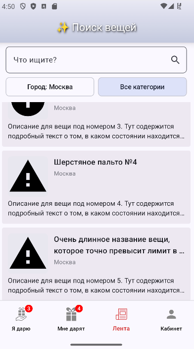
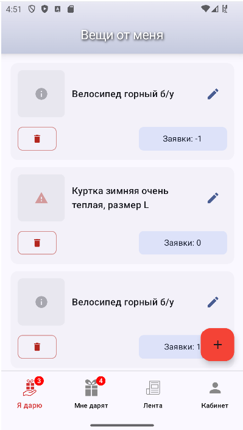
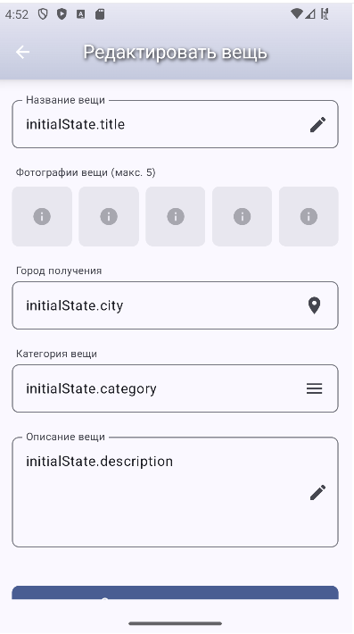
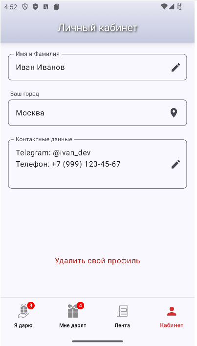

# Клиент для проекта SecondShelf

SecondShelf - это андроид-приложение для обмена вещами между участниками туристических групп. 

Приложение по функционалу напоминает собой Авито, но с той лишь разницей, что люди свободно обменивают вещи без 
какой-либо оплаты (в дар). 

Спеку на создание приложения (фронт + бек) Вы можете найти 
[здесь (PDF)](readme/specification.pdf)

Воркфлоу:
1) Даритель размещает заказ
2) Он попадает в общую ленту
3) Одаряемый (желающий) просматривает ленту в поисках нужной вещи
4) Одаряемый оставляет заявку на вещь и мотивационное письмо почему подарить должны именно ему.
5) Даритель выбирает из заявок одаряемого
6) Происходит обмен контактами (для встречи)
7) Вещь попадает в архив

Текущий статус:
Пока сделан только интерфейс на Jetpack Compose. Далее планируется дописать оставшуюся часть
приложения с использованием технологий MVI, Coroutines, Flow, Paging Library

Скриншоты (пилотная версия дизайна):

